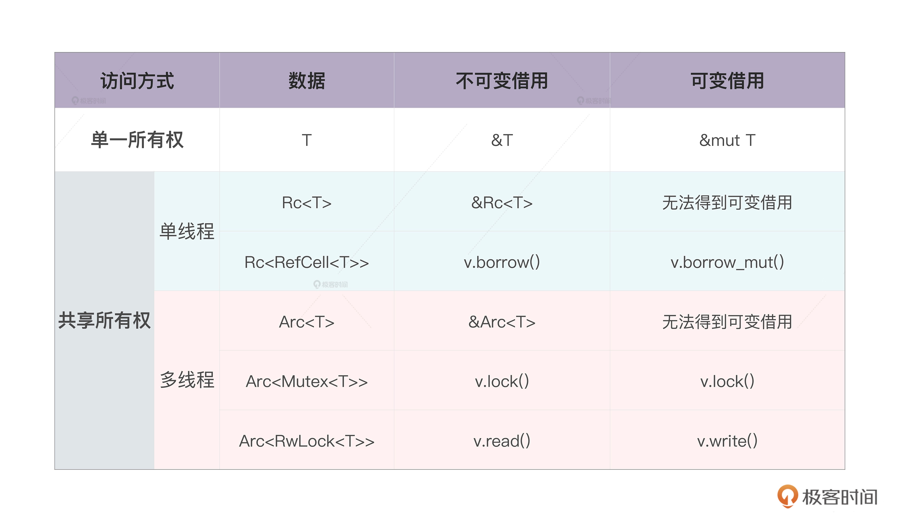
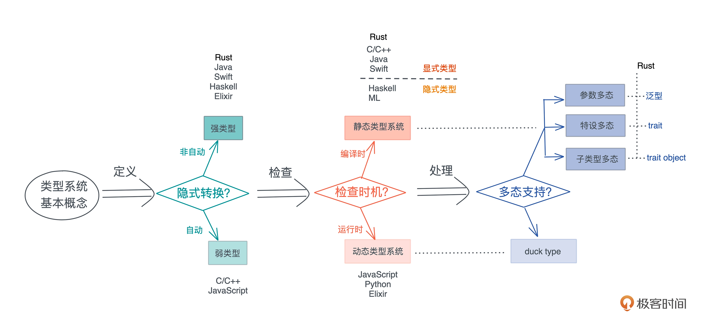
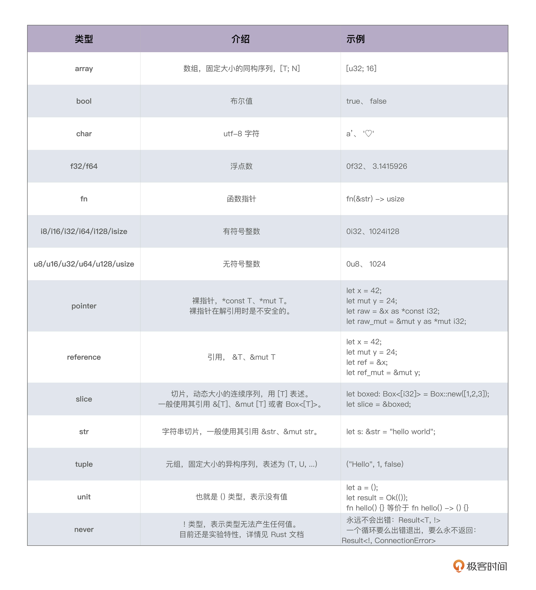
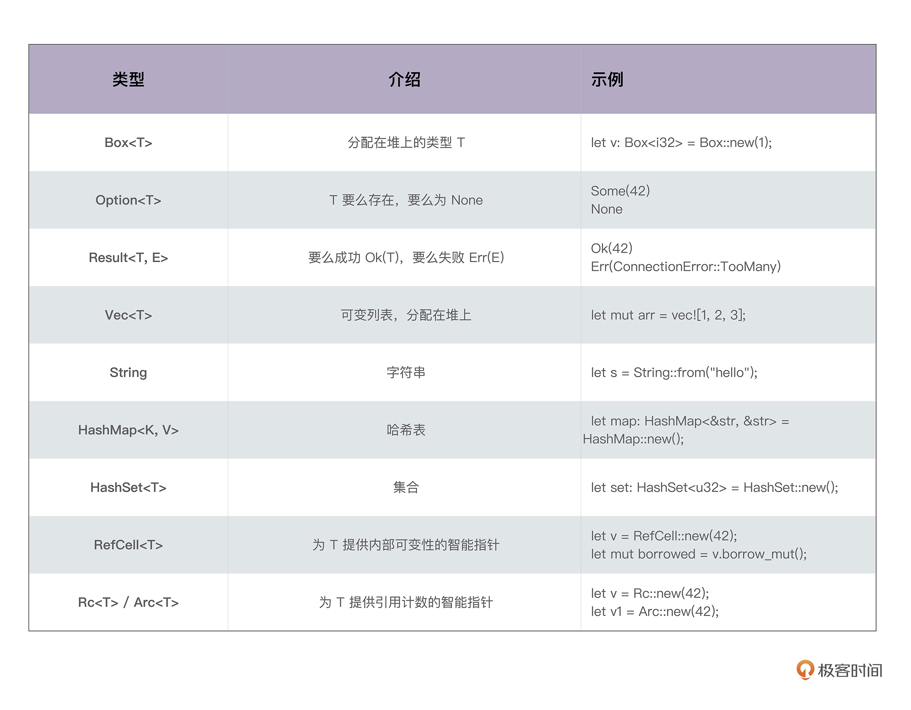
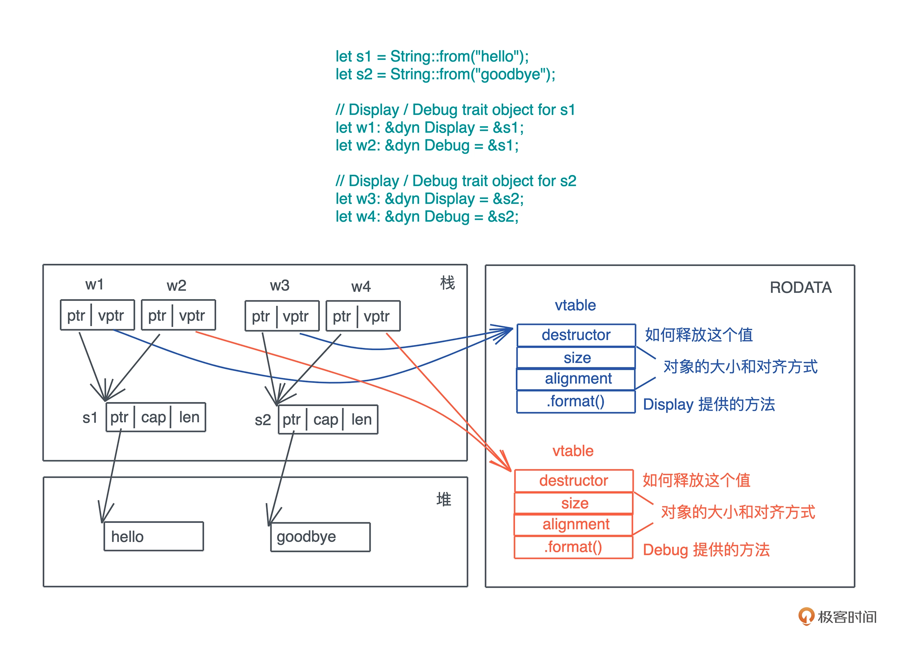
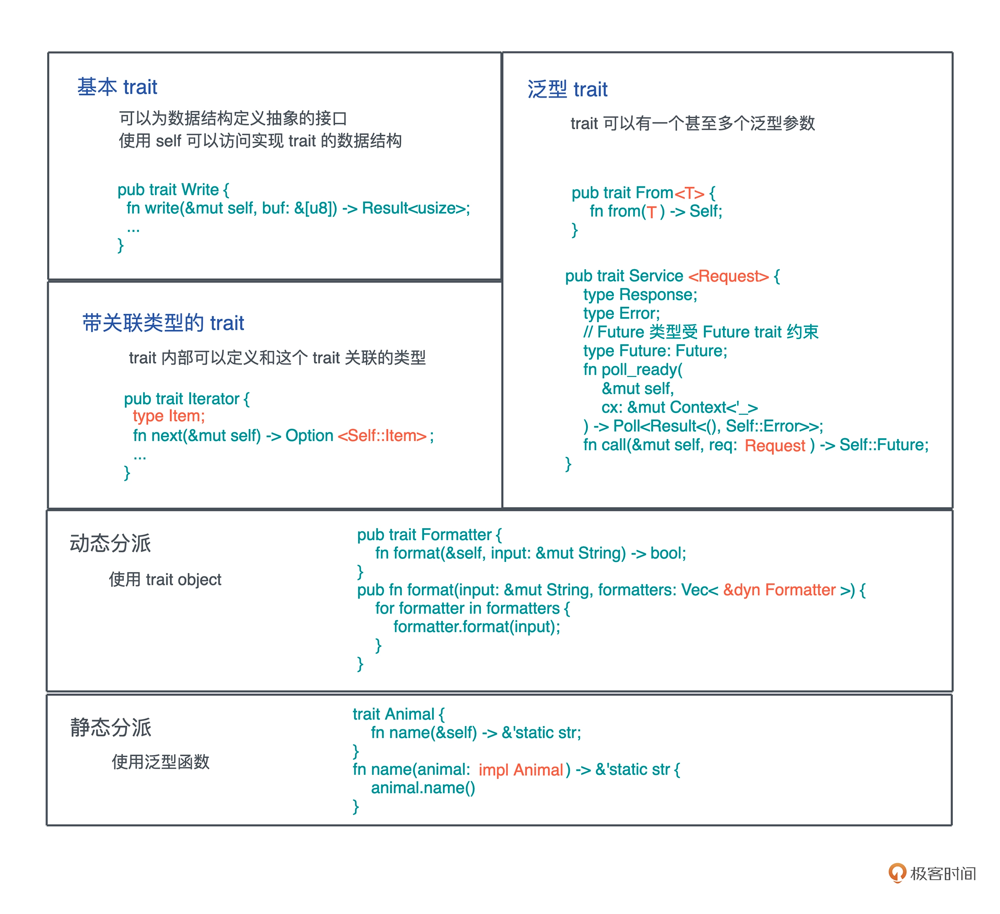
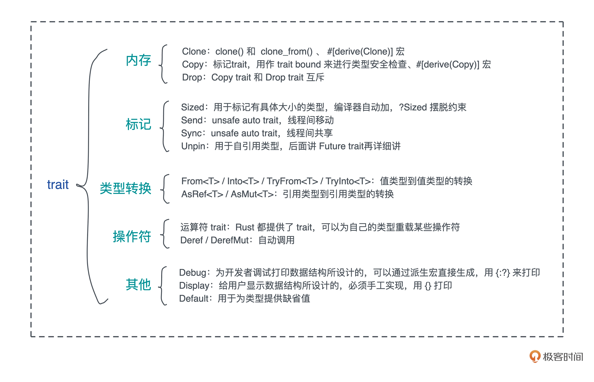

## tyrchen geektime-rust learning notes

[Go vs Rust](https://trio.dev/blog/golang-vs-rust)

Go for the code that has to ship tomorrow, Rust for the code that has to keep running for the next five years.

### Rust学习资料

文档：
- [Rust Book](https://doc.rust-lang.org/book/)
- [Rust 高级特性](https://doc.rust-lang.org/nomicon/)
- [Rust文档系统](https://docs.rs/)
- [Rust标准库文档](https://doc.rust-lang.org/stable/std/)


博客：
- [This Week in Rust](https://github.com/rust-lang/this-week-in-rust)
- [Rust 语言开源杂志](https://github.com/RustMagazine?type=source)

视频：
- [Beginner’s Series to: Rust](https://www.youtube.com/playlist?list=PLlrxD0HtieHjbTjrchBwOVks_sr8EVW1x)
- [Rust中高级视频](https://www.youtube.com/channel/UC_iD0xppBwwsrM9DegC5cQQ)

### Ownership

符合 Copy 语义的类型，在你赋值或者传参时，值会自动按位拷贝。
换句话说，当你要移动一个值，如果值的类型实现了 Copy trait，就会自动使用 Copy 语义进行拷贝，否则使用 Move 语义进行移动。

Copy trait:

- 原生类型，包括函数、不可变引用和裸指针实现了 Copy；
- 数组和元组，如果其内部的数据结构实现了 Copy，那么它们也实现了 Copy；
- 可变引用没有实现 Copy；
- 非固定大小的数据结构，没有实现 Copy。

Ownership:

- 所有权：一个值只能被一个变量所拥有，且同一时刻只能有一个所有者，当所有者离开作用域，其拥有的值被丢弃，内存得到释放。
- Move 语义：赋值或者传参会导致值 Move，所有权被转移，一旦所有权转移，之前的变量就不能访问。
- Copy 语义：如果值实现了 Copy trait，那么赋值或传参会使用 Copy 语义，相应的值会被按位拷贝（浅拷贝），产生新的值。

<details><summary>copy trait test</summary>
<p>

```rust
fn is_copy<T: Copy>() {}

fn types_impl_copy_trait() {
    is_copy::<bool>();
    is_copy::<char>();

    // all iXX and uXX, usize/isize, fXX implement Copy trait
    is_copy::<i8>();
    is_copy::<u64>();
    is_copy::<i64>();
    is_copy::<usize>();

    // function (actually a pointer) is Copy
    is_copy::<fn()>();

    // raw pointer is Copy
    is_copy::<*const String>();
    is_copy::<*mut String>();

    // immutable reference is Copy
    is_copy::<&[Vec<u8>]>();
    is_copy::<&String>();

    // array/tuple with values which is Copy is Copy
    is_copy::<[u8; 4]>();
    is_copy::<(&str, &str)>();
}

fn types_not_impl_copy_trait() {
    // unsized or dynamic sized type is not Copy
    is_copy::<str>();
    is_copy::<[u8]>();
    is_copy::<Vec<u8>>();
    is_copy::<String>();

    // mutable reference is not Copy
    is_copy::<&mut String>();

    // array / tuple with values that not Copy is not Copy
    is_copy::<[Vec<u8>; 4]>();
    is_copy::<(String, u32)>();
}
```

</p>
</details>

---

Borrow 语义允许一个值的所有权，在不发生转移的情况下，被其它上下文使用。就好像住酒店或者租房那样，旅客 / 租客只有房间的临时使用权，但没有它的所有权。另外，Borrow 语义通过引用语法（& 或者 &mut）来实现。

在 Rust 中，“借用”和“引用”是一个概念。所有的引用都只是借用了“临时使用权”，它并不破坏值的单一所有权约束。

#### 只读借用 / 引用

Rust 没有传引用的概念，Rust 所有的参数传递都是传值，不管是 Copy 还是 Move。所以在 Rust 中，你必须显式地把某个数据的引用，传给另一个函数。

Rust 的引用实现了 Copy trait，所以按照 Copy 语义，这个引用会被复制一份交给要调用的函数。对这个函数来说，它并不拥有数据本身，数据只是临时借给它使用，所有权还在原来的拥有者那里。

```rust
fn test() {
    let data = vec![1, 2, 3, 4];
    let data1 = &data;
    println!(
        "addr of value: {:p}({:p}), addr of data {:p}, data1: {:p}",
        &data, data1, &&data, &data1
    );
    // addr of value: 0x70000e365810(0x70000e365810), addr of data 0x70000e3658d0, data1: 0x70000e365828
}
```

#### 可变借用 / 引用
- 多个可变引用共存：它破坏了循环的不变性（loop invariant），容易导致死循环甚至系统崩

```rust
fn test() {
    let mut data = vec![1, 2, 3];

    for item in data.iter_mut() {
        data.push(*item + 1); // cannot borrow `data` as mutable more than once at a time
    }
}
```

- 同时有一个可变引用和若干个只读引用：堆上的数据预留的空间不够了，就会重新分配一片足够大的内存，把之前的值拷过来，然后释放旧的内存。这样就会让 data1 中保存的 &data[0] 引用失效，导致内存安全问题。

```rust
fn test() {
    let mut data = vec![1, 2, 3];
    let data1 = vec![&data[0]];
    println!("data[0]: {:p}", &data[0]);

    for i in 0..100 {
        data.push(i); // cannot borrow `data` as mutable because it is also borrowed as immutable
    }

    println!("data[0]: {:p}", &data[0]);
    println!("boxed: {:p}", &data1);
}
```

- 所有权规则 为了保证内存安全，Rust 对可变引用的使用也做了严格的约束：
  - 在一个作用域内，仅允许一个活跃的可变引用。所谓活跃，就是真正被使用来修改数据的可变引用，如果只是定义了，却没有使用或者当作只读引用使用，不算活跃。
  - 在一个作用域内，活跃的可变引用（写）和只读引用（读）是互斥的，不能同时存在。

#### 一个值有多个所有者

Rust 提供了运行时的动态检查，来满足特殊场景下的需求：
- Rc（Reference counter）：Rc 会把对应的数据结构创建在堆上，对一个 Rc 结构进行 clone()，不会将其内部的数据复制，只会增加引用计数。而当一个 Rc 结构离开作用域被 drop() 时，也只会减少其引用计数，直到引用计数为零，才会真正清除对应的内存。
- Arc（Atomic reference counter）：它实现了线程安全的引用计数器。。如果不用跨线程访问，可以用效率非常高的 Rc；如果要跨线程访问，那么必须用 Arc。

Rust 是如何进行所有权的静态检查和动态检查了：
- 静态检查，靠编译器保证代码符合所有权规则；
- 动态检查，通过 Box::leak 让堆内存拥有不受限的生命周期，然后在运行过程中，通过对引用计数的检查，保证这样的堆内存最终会得到释放。

RefCell 也绕过了 Rust 编译器的静态检查，允许我们在运行时，对某个只读数据进行可变借用：
- 外部可变性：mut 关键字声明，编译器可以在编译时进行严格地检查，保证只有可变的值或者可变的引用，才能修改值内部的数据。
- 内部可变性：RefCell 有时候我们希望能够绕开这个编译时的检查，对并未声明成 mut 的值或者引用。在编译器的眼里，值是只读的，但是在运行时，这个值可以得到可变借用，从而修改内部的数据。

<details><summary>Rc / Arc / RefCell / Mutex / RwLock 使用方式如图</summary>



</details>


### lifetime

在其它语言中，堆内存的生命周期是不确定的，或者是未定义的。因此，要么开发者手工维护，要么语言在运行时做额外的检查。而在 Rust 中，除非显式地做 Box::leak() / Box::into_raw() / ManualDrop 等动作，一般来说，堆内存的生命周期，会默认和其栈内存的生命周期绑定在一起。

#### 值的生命周期

- 静态生命周期：一个值的生命周期贯穿整个进程的生命周期，用 'static 来表示。如，全局变量、静态变量、字符串字面量（string literal）。
- 动态生命周期：一个值是在某个作用域中定义的，也就是说它被创建在栈上或者堆上。作用域结束时，值的生命周期也随之结束。我们约定用 'a 这样的小写字符或者字符串来表述。

生命周期参数，描述的是参数和参数之间、参数和返回值之间的关系，并不改变原有的生命周期。

**调用函数时，传入的参数的生命周期需要大于等于（outlive）标注的生命周期**。

编译器希望尽可能减轻开发者的负担，其实所有使用了引用的函数，都需要生命周期的标注，只不过编译器会自动做这件事，省却了开发者的麻烦。

### 内存管理

Rust 的创造者们，重新审视了堆内存的生命周期，发现大部分堆内存的需求在于动态大小，小部分需求是更长的生命周期。

所以它默认将堆内存的生命周期和使用它的栈内存的生命周期绑在一起，并留了个小口子 leaked 机制，让堆内存在需要的时候，可以有超出帧存活期的生命周期。

#### 值的创建

当我们为数据结构创建一个值，并将其赋给一个变量时，根据值的性质，它有可能被创建在栈上，也有可能被创建在堆上。

理论上，编译时可以确定大小的值都会放在栈上，包括 Rust 提供的原生类型比如字符、数组、元组（tuple）等，以及开发者自定义的固定大小的结构体（struct）、枚举（enum） 等。

如果数据结构的大小无法确定，或者它的大小确定但是在使用时需要更长的生命周期，就最好放在堆上。

#### 值的使用

一个值如果没有实现 Copy，在赋值、传参以及函数返回时会被 Move。

其实 Copy 和 Move 在内部实现上，都是浅层的按位做内存复制，只不过 Copy 允许你访问之前的变量，而 Move 不允许。

在我们的认知中，内存复制是个很重的操作，效率很低。但是，如果你要复制的只是原生类型（Copy）或者栈上的胖指针（Move），不涉及堆内存的复制也就是深拷贝（deep copy），那这个效率是非常高的，我们不必担心每次赋值或者每次传参带来的性能损失。

#### 值的销毁

当所有者离开作用域，它拥有的值会被丢弃，它的 Drop trait 会被调用。

如果要释放的值是一个复杂的数据结构，比如一个结构体，那么这个结构体在调用 drop() 时，会依次调用每一个域的 drop() 函数，如果域又是一个复杂的结构或者集合类型，就会递归下去，直到每一个域都释放干净。

Rust 的 Drop trait，还可以释放任何资源，比如 socket、文件、锁等等。Rust 对所有的资源都有很好的 RAII 支持。

### 类型系统

类型系统完全是一种工具，编译器在编译时对数据做静态检查，或者语言在运行时对数据做动态检查的时候，来保证某个操作处理的数据是开发者期望的数据类型

在类型系统中，多态是一个非常重要的思想，它是指在使用相同的接口时，不同类型的对象，会采用不同的实现。

对于动态类型系统，多态通过鸭子类型（duck typing）实现；而对于静态类型系统，多态可以通过参数多态（parametric polymorphism）、特设多态（adhoc polymorphism）和子类型多态（subtype polymorphism）实现。

- 参数多态是指，代码操作的类型是一个满足某些约束的参数，而非具体的类型。
- 特设多态是指，同一种行为有多个不同实现的多态。比如加法，可以 1+1，也可以是 “abc” + “cde”、matrix1 + matrix2、甚至 matrix1 + vector1。在面向对象编程语言中，特设多态一般指函数的重载。
- 子类型多态是指，在运行时，子类型可以被当成父类型使用。

在 Rust 中，参数多态通过泛型来支持、特设多态通过 trait 来支持、子类型多态可以用 trait object 来支持。

---
<details><summary>编程语言类型系统</summary>



</details>

按刚才不同阶段的分类：
- 在定义时，Rust 不允许类型的隐式转换，也就是说，Rust 是强类型语言。
- 在检查时，Rust 使用了静态类型系统，在编译期保证类型的正确。

强类型加静态类型，使得 Rust 是一门类型安全的语言。

Rust 中除了 let / fn / static / const 这些定义性语句外，都是表达式，而一切表达式都有类型，所以可以说在 Rust 中，类型无处不在。

在 Rust 中，对于一个作用域，无论是 if / else / for 循环，还是函数，最后一个表达式的返回值就是作用域的返回值，如果表达式或者函数不返回任何值，那么它返回一个 unit() 。unit 是只有一个值的类型，它的值和类型都是 () 。

#### 数据类型

<details><summary>原生类型</summary>



</details>

<details><summary>组合类型</summary>



</details>


#### 类型推到

作为静态类型系统的语言，虽然能够在编译期保证类型的安全，但一个很大的不便是，代码撰写起来很繁杂，到处都要进行类型的声明。
尤其刚刚讲了 Rust 的数据类型相当多，所以，为了减轻开发者的负担，Rust 支持局部的类型推导。

Rust 编译器需要足够的上下文来进行类型推导。

#### 泛型实现 参数多态

在表述泛型参数的约束时，Rust 允许两种方式：
- 一种类似函数参数的类型声明，用 “:” 来表明约束，多个约束之间用 + 来表示；
- 另一种是使用 where 子句，在定义的结尾来表明参数的约束。两种方法都可以，且可以共存。

泛型函数：我们还可以不指定具体的参数或返回值的类型，而是由泛型参数来代替。
- Rust 会进行单态化（Monomorphization）处理，也就是在编译时，把所有用到的泛型函数的泛型参数展开，生成若干个函数。
- 单态化的好处是，泛型函数的调用是静态分派（static dispatch），在编译时就一一对应，既保有多态的灵活性，又没有任何效率的损失，和普通函数调用一样高效。

#### trait实现 特设多态

trait 是 Rust 中的接口，它定义了类型使用这个接口的行为。在 trait 中，方法可以有缺省的实现。比如std::io::write

```rust
pub trait Write {
  fn write(&mut self, buf: &[u8]) -> Result<usize>;
  fn flush(&mut self) -> Result<()>;
  fn write_vectored(&mut self, bufs: &[IoSlice<'_>]) -> Result<usize> { ... }
  fn is_write_vectored(&self) -> bool { ... }
  fn write_all(&mut self, buf: &[u8]) -> Result<()> { ... }
  fn write_all_vectored(&mut self, bufs: &mut [IoSlice<'_>]) -> Result<()> { ... }
  fn write_fmt(&mut self, fmt: Arguments<'_>) -> Result<()> { ... }
  fn by_ref(&mut self) -> &mut Self where Self: Sized { ... }
}
```

- Self 代表当前的类型，比如 File 类型实现了 Write，那么实现过程中使用到的 Self 就指代 File。
- self 在用作方法的第一个参数时，实际上是 self: Self 的简写，所以 &self 是 self: &Self, 而 &mut self 是 self: &mut Self。

---

Rust 允许 trait 内部包含关联类型，实现时跟关联函数一样，它也需要实现关联类型。

```rust
pub trait Parse {
    type Error;
    fn parse(s: &str) -> Result<Self, Self::Error>;
}
```

--- 

泛型trait，参考 [tower::Service](https://docs.rs/tower/0.4.11/tower/trait.Service.html)

---

在 Rust 中，一个 trait 可以“继承”另一个 trait 的关联类型和关联函数。

比如 trait B: A ，是说任何类型 T，如果实现了 trait B，它也必须实现 trait A，换句话说，trait B 在定义时可以使用 trait A 中的关联类型和方法。

#### trait object实现 子类型多态

Rust 虽然没有父类和子类，但 trait 和实现 trait 的类型之间也是类似的关系，所以，Rust 也可以做子类型多态。

静态分派固然很好，效率很高，但很多时候，类型可能很难在编译时决定。

所以我们要有一种手段，告诉编译器，此处需要并且仅需要任何实现了 Formatter 接口的数据类型。在 Rust 里，这种类型叫 Trait Object，表现为 &dyn Trait 或者 Box<dyn Trait>。

```rust
// 这样可以在运行时，构造一个 Formatter 的列表，传递给 format 函数进行文件的格式化，这就是动态分派（dynamic dispatching）。
pub fn format(input: &mut String, formatters: Vec<&dyn Formatter>) {
    for formatter in formatters {
        formatter.format(input);
    }
}
```

---

Trait Object 的实现机理

Trait Object 的底层逻辑就是胖指针。其中，一个指针指向数据本身，另一个则指向虚函数表（vtable）。

vtable 是一张静态的表，Rust 在编译时会为使用了 trait object 的类型的 trait 实现生成一张表，放在可执行文件中（一般在 TEXT 或 RODATA 段）。看下图，可以帮助你理解

<details><summary>Rust Trait Object</summary>



</details>

<details><summary>Trait Summary</summary>



</details>

<details><summary>必须掌握的 traits</summary>



</details>

### 数据结构

#### 智能指针

智能指针是一个表现行为很像指针的数据结构，但除了指向数据的指针外，它还有元数据以提供额外的处理能力。

String 对堆上的值有所有权，而 &str 是没有所有权的，这是 Rust 中智能指针和普通胖指针的区别。

在 Rust 中，凡是需要做资源回收的数据结构，且实现了 Deref/DerefMut/Drop，都是智能指针。

--- 

Box，它是 Rust 中最基本的在堆上分配内存的方式，绝大多数其它包含堆内存分配的数据类型，内部都是通过 Box<T> 完成的，比如 Vec<T>。

Box::new() 是一个函数，所以传入它的数据会出现在栈上，再移动到堆上。注意，下面的inline，在release模式下，这个函数会被优化掉。
也就是说，release模式下传入的数据，会直接分配在堆上。

```rust
#[cfg(not(no_global_oom_handling))]
#[inline(always)]
#[doc(alias = "alloc")]
#[doc(alias = "malloc")]
#[stable(feature = "rust1", since = "1.0.0")]
pub fn new(x: T) -> Self {
    box x
}
```

---

