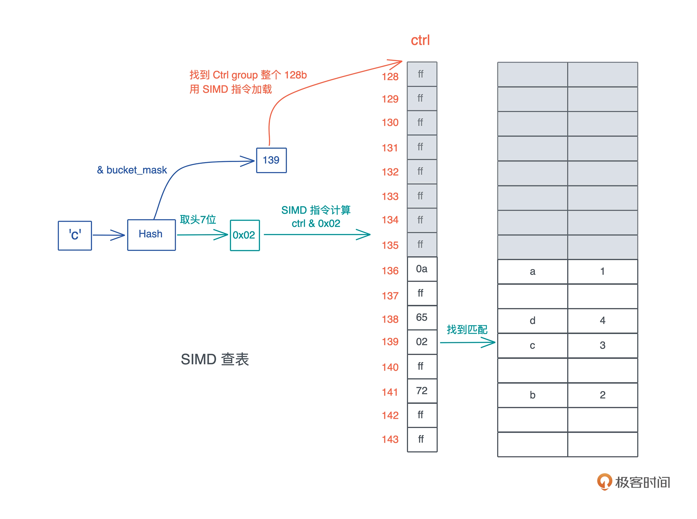

## tyrchen geektime-rust learning notes

[Go vs Rust](https://trio.dev/blog/golang-vs-rust)

Go for the code that has to ship tomorrow, Rust for the code that has to keep running for the next five years.

### Rust学习资料

文档：
- [Rust Book](https://doc.rust-lang.org/book/)
- [Rust 高级特性](https://doc.rust-lang.org/nomicon/)
- [Rust文档系统](https://docs.rs/)
- [Rust标准库文档](https://doc.rust-lang.org/stable/std/)


博客：
- [This Week in Rust](https://github.com/rust-lang/this-week-in-rust)
- [Rust 语言开源杂志](https://github.com/RustMagazine?type=source)

视频：
- [Beginner’s Series to: Rust](https://www.youtube.com/playlist?list=PLlrxD0HtieHjbTjrchBwOVks_sr8EVW1x)
- [Rust中高级视频](https://www.youtube.com/channel/UC_iD0xppBwwsrM9DegC5cQQ)

### Ownership

符合 Copy 语义的类型，在你赋值或者传参时，值会自动按位拷贝。
换句话说，当你要移动一个值，如果值的类型实现了 Copy trait，就会自动使用 Copy 语义进行拷贝，否则使用 Move 语义进行移动。

Copy trait:

- 原生类型，包括函数、不可变引用和裸指针实现了 Copy；
- 数组和元组，如果其内部的数据结构实现了 Copy，那么它们也实现了 Copy；
- 可变引用没有实现 Copy；
- 非固定大小的数据结构，没有实现 Copy。

Ownership:

- 所有权：一个值只能被一个变量所拥有，且同一时刻只能有一个所有者，当所有者离开作用域，其拥有的值被丢弃，内存得到释放。
- Move 语义：赋值或者传参会导致值 Move，所有权被转移，一旦所有权转移，之前的变量就不能访问。
- Copy 语义：如果值实现了 Copy trait，那么赋值或传参会使用 Copy 语义，相应的值会被按位拷贝（浅拷贝），产生新的值。

<details><summary>copy trait test</summary>
<p>

```rust
fn is_copy<T: Copy>() {}

fn types_impl_copy_trait() {
    is_copy::<bool>();
    is_copy::<char>();

    // all iXX and uXX, usize/isize, fXX implement Copy trait
    is_copy::<i8>();
    is_copy::<u64>();
    is_copy::<i64>();
    is_copy::<usize>();

    // function (actually a pointer) is Copy
    is_copy::<fn()>();

    // raw pointer is Copy
    is_copy::<*const String>();
    is_copy::<*mut String>();

    // immutable reference is Copy
    is_copy::<&[Vec<u8>]>();
    is_copy::<&String>();

    // array/tuple with values which is Copy is Copy
    is_copy::<[u8; 4]>();
    is_copy::<(&str, &str)>();
}

fn types_not_impl_copy_trait() {
    // unsized or dynamic sized type is not Copy
    is_copy::<str>();
    is_copy::<[u8]>();
    is_copy::<Vec<u8>>();
    is_copy::<String>();

    // mutable reference is not Copy
    is_copy::<&mut String>();

    // array / tuple with values that not Copy is not Copy
    is_copy::<[Vec<u8>; 4]>();
    is_copy::<(String, u32)>();
}
```

</p>
</details>

---

Borrow 语义允许一个值的所有权，在不发生转移的情况下，被其它上下文使用。就好像住酒店或者租房那样，旅客 / 租客只有房间的临时使用权，但没有它的所有权。另外，Borrow 语义通过引用语法（& 或者 &mut）来实现。

在 Rust 中，“借用”和“引用”是一个概念。所有的引用都只是借用了“临时使用权”，它并不破坏值的单一所有权约束。

#### 只读借用 / 引用

Rust 没有传引用的概念，Rust 所有的参数传递都是传值，不管是 Copy 还是 Move。所以在 Rust 中，你必须显式地把某个数据的引用，传给另一个函数。

Rust 的引用实现了 Copy trait，所以按照 Copy 语义，这个引用会被复制一份交给要调用的函数。对这个函数来说，它并不拥有数据本身，数据只是临时借给它使用，所有权还在原来的拥有者那里。

```rust
fn test() {
    let data = vec![1, 2, 3, 4];
    let data1 = &data;
    println!(
        "addr of value: {:p}({:p}), addr of data {:p}, data1: {:p}",
        &data, data1, &&data, &data1
    );
    // addr of value: 0x70000e365810(0x70000e365810), addr of data 0x70000e3658d0, data1: 0x70000e365828
}
```

#### 可变借用 / 引用
- 多个可变引用共存：它破坏了循环的不变性（loop invariant），容易导致死循环甚至系统崩

```rust
fn test() {
    let mut data = vec![1, 2, 3];

    for item in data.iter_mut() {
        data.push(*item + 1); // cannot borrow `data` as mutable more than once at a time
    }
}
```

- 同时有一个可变引用和若干个只读引用：堆上的数据预留的空间不够了，就会重新分配一片足够大的内存，把之前的值拷过来，然后释放旧的内存。这样就会让 data1 中保存的 &data[0] 引用失效，导致内存安全问题。

```rust
fn test() {
    let mut data = vec![1, 2, 3];
    let data1 = vec![&data[0]];
    println!("data[0]: {:p}", &data[0]);

    for i in 0..100 {
        data.push(i); // cannot borrow `data` as mutable because it is also borrowed as immutable
    }

    println!("data[0]: {:p}", &data[0]);
    println!("boxed: {:p}", &data1);
}
```

- 所有权规则 为了保证内存安全，Rust 对可变引用的使用也做了严格的约束：
  - 在一个作用域内，仅允许一个活跃的可变引用。所谓活跃，就是真正被使用来修改数据的可变引用，如果只是定义了，却没有使用或者当作只读引用使用，不算活跃。
  - 在一个作用域内，活跃的可变引用（写）和只读引用（读）是互斥的，不能同时存在。

#### 一个值有多个所有者

Rust 提供了运行时的动态检查，来满足特殊场景下的需求：
- Rc（Reference counter）：Rc 会把对应的数据结构创建在堆上，对一个 Rc 结构进行 clone()，不会将其内部的数据复制，只会增加引用计数。而当一个 Rc 结构离开作用域被 drop() 时，也只会减少其引用计数，直到引用计数为零，才会真正清除对应的内存。
- Arc（Atomic reference counter）：它实现了线程安全的引用计数器。。如果不用跨线程访问，可以用效率非常高的 Rc；如果要跨线程访问，那么必须用 Arc。

Rust 是如何进行所有权的静态检查和动态检查了：
- 静态检查，靠编译器保证代码符合所有权规则；
- 动态检查，通过 Box::leak 让堆内存拥有不受限的生命周期，然后在运行过程中，通过对引用计数的检查，保证这样的堆内存最终会得到释放。

RefCell 也绕过了 Rust 编译器的静态检查，允许我们在运行时，对某个只读数据进行可变借用：
- 外部可变性：mut 关键字声明，编译器可以在编译时进行严格地检查，保证只有可变的值或者可变的引用，才能修改值内部的数据。
- 内部可变性：RefCell 有时候我们希望能够绕开这个编译时的检查，对并未声明成 mut 的值或者引用。在编译器的眼里，值是只读的，但是在运行时，这个值可以得到可变借用，从而修改内部的数据。

<details><summary>Rc / Arc / RefCell / Mutex / RwLock 使用方式如图</summary>


</details>


### lifetime

在其它语言中，堆内存的生命周期是不确定的，或者是未定义的。因此，要么开发者手工维护，要么语言在运行时做额外的检查。而在 Rust 中，除非显式地做 Box::leak() / Box::into_raw() / ManualDrop 等动作，一般来说，堆内存的生命周期，会默认和其栈内存的生命周期绑定在一起。

#### 值的生命周期

- 静态生命周期：一个值的生命周期贯穿整个进程的生命周期，用 'static 来表示。如，全局变量、静态变量、字符串字面量（string literal）。
- 动态生命周期：一个值是在某个作用域中定义的，也就是说它被创建在栈上或者堆上。作用域结束时，值的生命周期也随之结束。我们约定用 'a 这样的小写字符或者字符串来表述。

- `[static的误解](https://github.com/pretzelhammer/rust-blog/blob/master/posts/common-rust-lifetime-misconceptions.md#2-if-t-static-then-t-must-be-valid-for-the-entire-program)`
- since T: 'static includes owned types that means T
  - can be dynamically allocated at run-time
  - does not have to be valid for the entire program
  - can be safely and freely mutated
  - can be dynamically dropped at run-time
  - can have lifetimes of different durations

生命周期参数，描述的是参数和参数之间、参数和返回值之间的关系，并不改变原有的生命周期。

**调用函数时，传入的参数的生命周期需要大于等于（outlive）标注的生命周期**。

编译器希望尽可能减轻开发者的负担，其实所有使用了引用的函数，都需要生命周期的标注，只不过编译器会自动做这件事，省却了开发者的麻烦。

### 内存管理

Rust 的创造者们，重新审视了堆内存的生命周期，发现大部分堆内存的需求在于动态大小，小部分需求是更长的生命周期。

所以它默认将堆内存的生命周期和使用它的栈内存的生命周期绑在一起，并留了个小口子 leaked 机制，让堆内存在需要的时候，可以有超出帧存活期的生命周期。

#### 值的创建

当我们为数据结构创建一个值，并将其赋给一个变量时，根据值的性质，它有可能被创建在栈上，也有可能被创建在堆上。

理论上，编译时可以确定大小的值都会放在栈上，包括 Rust 提供的原生类型比如字符、数组、元组（tuple）等，以及开发者自定义的固定大小的结构体（struct）、枚举（enum） 等。

如果数据结构的大小无法确定，或者它的大小确定但是在使用时需要更长的生命周期，就最好放在堆上。

#### 值的使用

一个值如果没有实现 Copy，在赋值、传参以及函数返回时会被 Move。

其实 Copy 和 Move 在内部实现上，都是浅层的按位做内存复制，只不过 Copy 允许你访问之前的变量，而 Move 不允许。

在我们的认知中，内存复制是个很重的操作，效率很低。但是，如果你要复制的只是原生类型（Copy）或者栈上的胖指针（Move），不涉及堆内存的复制也就是深拷贝（deep copy），那这个效率是非常高的，我们不必担心每次赋值或者每次传参带来的性能损失。

#### 值的销毁

当所有者离开作用域，它拥有的值会被丢弃，它的 Drop trait 会被调用。

如果要释放的值是一个复杂的数据结构，比如一个结构体，那么这个结构体在调用 drop() 时，会依次调用每一个域的 drop() 函数，如果域又是一个复杂的结构或者集合类型，就会递归下去，直到每一个域都释放干净。

Rust 的 Drop trait，还可以释放任何资源，比如 socket、文件、锁等等。Rust 对所有的资源都有很好的 RAII 支持。

### 类型系统

类型系统完全是一种工具，编译器在编译时对数据做静态检查，或者语言在运行时对数据做动态检查的时候，来保证某个操作处理的数据是开发者期望的数据类型

在类型系统中，多态是一个非常重要的思想，它是指在使用相同的接口时，不同类型的对象，会采用不同的实现。

对于动态类型系统，多态通过鸭子类型（duck typing）实现；而对于静态类型系统，多态可以通过参数多态（parametric polymorphism）、特设多态（adhoc polymorphism）和子类型多态（subtype polymorphism）实现。

- 参数多态是指，代码操作的类型是一个满足某些约束的参数，而非具体的类型。
- 特设多态是指，同一种行为有多个不同实现的多态。比如加法，可以 1+1，也可以是 “abc” + “cde”、matrix1 + matrix2、甚至 matrix1 + vector1。在面向对象编程语言中，特设多态一般指函数的重载。
- 子类型多态是指，在运行时，子类型可以被当成父类型使用。

在 Rust 中，参数多态通过泛型来支持、特设多态通过 trait 来支持、子类型多态可以用 trait object 来支持。

---
<details><summary>编程语言类型系统</summary>


</details>

按刚才不同阶段的分类：
- 在定义时，Rust 不允许类型的隐式转换，也就是说，Rust 是强类型语言。
- 在检查时，Rust 使用了静态类型系统，在编译期保证类型的正确。

强类型加静态类型，使得 Rust 是一门类型安全的语言。

Rust 中除了 let / fn / static / const 这些定义性语句外，都是表达式，而一切表达式都有类型，所以可以说在 Rust 中，类型无处不在。

在 Rust 中，对于一个作用域，无论是 if / else / for 循环，还是函数，最后一个表达式的返回值就是作用域的返回值，如果表达式或者函数不返回任何值，那么它返回一个 unit() 。unit 是只有一个值的类型，它的值和类型都是 () 。

#### 数据类型

<details><summary>原生类型</summary>


</details>

<details><summary>组合类型</summary>


</details>


#### 类型推到

作为静态类型系统的语言，虽然能够在编译期保证类型的安全，但一个很大的不便是，代码撰写起来很繁杂，到处都要进行类型的声明。
尤其刚刚讲了 Rust 的数据类型相当多，所以，为了减轻开发者的负担，Rust 支持局部的类型推导。

Rust 编译器需要足够的上下文来进行类型推导。

#### 泛型实现 参数多态

在表述泛型参数的约束时，Rust 允许两种方式：
- 一种类似函数参数的类型声明，用 “:” 来表明约束，多个约束之间用 + 来表示；
- 另一种是使用 where 子句，在定义的结尾来表明参数的约束。两种方法都可以，且可以共存。

泛型函数：我们还可以不指定具体的参数或返回值的类型，而是由泛型参数来代替。
- Rust 会进行单态化（Monomorphization）处理，也就是在编译时，把所有用到的泛型函数的泛型参数展开，生成若干个函数。
- 单态化的好处是，泛型函数的调用是静态分派（static dispatch），在编译时就一一对应，既保有多态的灵活性，又没有任何效率的损失，和普通函数调用一样高效。

#### trait实现 特设多态

trait 是 Rust 中的接口，它定义了类型使用这个接口的行为。在 trait 中，方法可以有缺省的实现。比如std::io::write

```rust
pub trait Write {
  fn write(&mut self, buf: &[u8]) -> Result<usize>;
  fn flush(&mut self) -> Result<()>;
  fn write_vectored(&mut self, bufs: &[IoSlice<'_>]) -> Result<usize> { ... }
  fn is_write_vectored(&self) -> bool { ... }
  fn write_all(&mut self, buf: &[u8]) -> Result<()> { ... }
  fn write_all_vectored(&mut self, bufs: &mut [IoSlice<'_>]) -> Result<()> { ... }
  fn write_fmt(&mut self, fmt: Arguments<'_>) -> Result<()> { ... }
  fn by_ref(&mut self) -> &mut Self where Self: Sized { ... }
}
```

- Self 代表当前的类型，比如 File 类型实现了 Write，那么实现过程中使用到的 Self 就指代 File。
- self 在用作方法的第一个参数时，实际上是 self: Self 的简写，所以 &self 是 self: &Self, 而 &mut self 是 self: &mut Self。

---

Rust 允许 trait 内部包含关联类型，实现时跟关联函数一样，它也需要实现关联类型。

```rust
pub trait Parse {
    type Error;
    fn parse(s: &str) -> Result<Self, Self::Error>;
}
```

--- 

泛型trait，参考 [tower::Service](https://docs.rs/tower/0.4.11/tower/trait.Service.html)

---

在 Rust 中，一个 trait 可以“继承”另一个 trait 的关联类型和关联函数。

比如 trait B: A ，是说任何类型 T，如果实现了 trait B，它也必须实现 trait A，换句话说，trait B 在定义时可以使用 trait A 中的关联类型和方法。

#### trait object实现 子类型多态

Rust 虽然没有父类和子类，但 trait 和实现 trait 的类型之间也是类似的关系，所以，Rust 也可以做子类型多态。

静态分派固然很好，效率很高，但很多时候，类型可能很难在编译时决定。

所以我们要有一种手段，告诉编译器，此处需要并且仅需要任何实现了 Formatter 接口的数据类型。在 Rust 里，这种类型叫 Trait Object，表现为 &dyn Trait 或者 Box<dyn Trait>。

```rust
// 这样可以在运行时，构造一个 Formatter 的列表，传递给 format 函数进行文件的格式化，这就是动态分派（dynamic dispatching）。
pub fn format(input: &mut String, formatters: Vec<&dyn Formatter>) {
    for formatter in formatters {
        formatter.format(input);
    }
}
```

---

Trait Object 的实现机理

Trait Object 的底层逻辑就是胖指针。其中，一个指针指向数据本身，另一个则指向虚函数表（vtable）。

vtable 是一张静态的表，Rust 在编译时会为使用了 trait object 的类型的 trait 实现生成一张表，放在可执行文件中（一般在 TEXT 或 RODATA 段）。看下图，可以帮助你理解

<details><summary>Rust Trait Object</summary>


</details>

<details><summary>Trait Summary</summary>


</details>

<details><summary>必须掌握的 traits</summary>


</details>

### 数据结构

#### 智能指针

智能指针是一个表现行为很像指针的数据结构，但除了指向数据的指针外，它还有元数据以提供额外的处理能力。

String 对堆上的值有所有权，而 &str 是没有所有权的，这是 Rust 中智能指针和普通胖指针的区别。

在 Rust 中，凡是需要做资源回收的数据结构，且实现了 Deref/DerefMut/Drop，都是智能指针。

--- 

Box，它是 Rust 中最基本的在堆上分配内存的方式，绝大多数其它包含堆内存分配的数据类型，内部都是通过 Box<T> 完成的，比如 Vec<T>。

Box::new() 是一个函数，所以传入它的数据会出现在栈上，再移动到堆上。注意，下面的inline，在release模式下，这个函数会被优化掉。
也就是说，release模式下传入的数据，会直接分配在堆上。

```rust
#[cfg(not(no_global_oom_handling))]
#[inline(always)]
#[doc(alias = "alloc")]
#[doc(alias = "malloc")]
#[stable(feature = "rust1", since = "1.0.0")]
pub fn new(x: T) -> Self {
    box x
}
```

---

Cow 是 Rust 下用于提供写时克隆（Clone-on-Write）的一个智能指针。 它是一个 enum，可以包含一个对类型 B 的只读引用，或者包含对类型 B 的拥有所有权的数据。

Cow通过deref实现了，一个类型被borrow成不同类型。其中ToOwned含义：B可以转换为它owned type，比如 &str 可以转成 String。

使用场景：它可以在需要的时候才进行内存的分配和拷贝。如果 Cow<'a, B> 中的 Owned 数据类型是一个需要在堆上分配内存的类型，如 String、Vec 等，还能减少堆内存分配的次数。

```rust
pub enum Cow<'a, B> where B: 'a + ToOwned + ?Sized {
  Borrowed(&'a B),
  Owned(<B as ToOwned>::Owned),
}

impl<B: ?Sized + ToOwned> Deref for Cow<'_, B> {
  type Target = B;

  fn deref(&self) -> &B {
    match *self {
      Borrowed(borrowed) => borrowed,
      Owned(ref owned) => owned.borrow(),
    }
  }
}
```
---

MutexGuard ：它不但通过 Deref 提供良好的用户体验，还通过 Drop trait 来确保，使用到的内存以外的资源在退出时进行释放

MutexGuard这个结构是在调用 Mutex::lock 时生成。

当 MutexGuard 结束时，Mutex 会做 unlock，这样用户在使用 Mutex 时，可以不必关心何时释放这个互斥锁。因为无论你在调用栈上怎样传递 MutexGuard ，哪怕在错误处理流程上提前退出，Rust 有所有权机制，可以确保只要 MutexGuard 离开作用域，锁就会被释放。

MutexGuard 不允许 Send，只允许 Sync，也就是说，你可以把 MutexGuard 的引用传给另一个线程使用，但你无法把 MutexGuard 整个移动到另一个线程

#### 切片

<details><summary>Rust Container Type</summary>


</details>

---

切片：描述一组属于同一类型、长度不确定的、在内存中连续存放的数据结构，用 [T] 来表述。因为长度不确定，所以切片是个 DST（Dynamically Sized Type）。

- &[T]：表示一个只读的切片引用。
- &mut [T]：表示一个可写的切片引用。
- Box<[T]>：一个在堆上分配的切片。

vector 和 array 都可以方便转为 slice：
- Vec 实现了 Deref trait
- array 内建了到 &[T] 的解引用

转成slice后，都会获得切片的所有能力，包括：binary_search、chunks、concat、contains、start_with、end_with、group_by、iter、join、sort、split、swap 等一系列丰富的功能

---

特殊的切片：&str

String 是一个特殊的 Vec，所以在 String 上做切片，也是一个特殊的结构 &str。

String 在解引用时，会转换成 &str，如: &String 会被解引用成 &str

[What are Rust's exact auto-dereferencing rules?](https://stackoverflow.com/questions/28519997/what-are-rusts-exact-auto-dereferencing-rules/28552082)

---

Box<[T]> 是一个比较有意思的存在，它和 Vec 有一点点差别：Vec 有额外的 capacity，可以增长；而 Box<[T]> 一旦生成就固定下来，没有 capacity，也无法增长。

Box<[T]> 和切片的引用 &[T] 也很类似：它们都是在栈上有一个包含长度的胖指针，指向存储数据的内存位置。区别是：Box<[T]> 只会指向堆，&[T] 指向的位置可以是栈也可以是堆；此外，Box<[T]> 对数据具有所有权，而 &[T] 只是一个借用。

当我们需要在堆上创建固定大小的集合数据，且不希望自动增长，那么，可以先创建 Vec<T>，再转换成 Box<[T]>

当 Vec 转换成 Box<[T]> 时，没有使用到的容量就会被丢弃，所以整体占用的内存可能会降低。

而且 Box<[T]> 有一个很好的特性是，不像 Box<[T;n]> 那样在编译时就要确定大小，它可以在运行期生成，以后大小不会再改变。

<details><summary>Slice Types</summary>


</details>


#### 哈希表

A hash map implemented with quadratic probing and SIMD lookup.

---

开放寻址法 的 二次探查：

哈希表最核心的特点就是：巨量的可能输入和有限的哈希表容量。这就会引发哈希冲突，也就是两个或者多个输入的哈希被映射到了同一个位置，所以我们要能够处理哈希冲突。

理论上，主要的冲突解决机制有链地址法（chaining）和开放寻址法（open addressing）。

链地址法，我们比较熟悉，就是把落在同一个哈希上的数据用单链表或者双链表连接起来。这样在查找的时候，先找到对应的哈希桶（hash bucket），然后再在冲突链上挨个比较，直到找到匹配的项

冲突链处理哈希冲突非常直观，很容易理解和撰写代码，但缺点是哈希表和冲突链使用了不同的内存，对缓存不友好。

开放寻址法，把整个哈希表看做一个大数组，不引入额外的内存，当冲突产生时，按照一定的规则把数据插入到其它空闲的位置。比如线性探寻（linear probing）在出现哈希冲突时，不断往后探寻，直到找到空闲的位置插入。

二次探查（quadratic probing）:理论上是在冲突发生时，不断探寻哈希位置加减 n 的二次方，找到空闲的位置插入，我们看图，更容易理解

---

SIMD 查表（SIMD lookup）:

Rust 的 HashMap 复用了 hashbrown 的 HashMap。hashbrown 是 Rust 下对 [Google Swiss Table](https://abseil.io/blog/20180927-swisstables) 的一个改进版实现

<details><summary>HashMap的内存布局 与 SIMD</summary>

如下图：其中

- bucket_mask，是哈希表中哈希桶的数量减一
- ctrl 的指针，它指向哈希表堆内存末端的 ctrl 区，通过这个地址，计算出哈希表堆地址的起始地址。
- growth_left，指哈希表在下次自动增长前还能存储多少数据

插入流程：key ‘a’ 的 hash 和 bucket_mask 0x3 运算后得到第 0 个位置插入。同时，这个 hash 的头 7 位取出来，在 ctrl 表中对应的位置，也就是第 0 个字节，把这个值写入。


ctrl 表的主要目的是快速查找，如下图

查询流程：

1. 首先对 ‘c’ 做哈希，得到一个哈希值 h；
2. 把 h 跟 bucket_mask 做与，得到一个值，图中是 139；
3. 拿着这个 139，找到对应的 ctrl group 的起始位置，因为 ctrl group 以 16 为一组，所以这里找到 128；
4. 用 SIMD 指令加载从 128 对应地址开始的 16 个字节 (即一个 ctrl group 的数据)；
5. 对 hash 取头 7 个 bit，然后和刚刚取出的 16 个字节一起做与，找到对应的匹配，如果找到了，它（们）很大概率是要找的值；
6. 如果不是，那么以二次探查（以 16 的倍数不断累积）的方式往后查找，直到找到为止。



</details>

---

扩容：

HashMap::new() 时，它并没有分配空间，容量为零，随着哈希表不断插入数据，它会以 2 的幂减一的方式增长，最小是 3。当删除表中的数据时，原有的表大小不变，只有显式地调用 shrink_to_fit，才会让哈希表变小。

首先，哈希表会按幂扩容，从 4 个 bucket 扩展到 8 个 bucket。

---

自定义Hash Key

要使用到三个 trait：Hash、PartialEq、Eq，不过这三个 trait 都可以通过派生宏自动生成。其中

- 实现了 Hash ，可以让数据结构计算哈希；
- 实现了 PartialEq/Eq，可以让数据结构进行相等和不相等的比较。Eq 实现了比较的自反性（a == a）、对称性（a == b 则 b == a）以及传递性（a == b，b == c，则 a == c），PartialEq 没有实现自反性。

参考hashmap.rs

### 闭包

闭包是一种匿名类型，一旦声明，就会产生一个新的类型，但这个类型无法被其它地方使用。这个类型就像一个结构体，会包含所有捕获的变量。

闭包的大小跟参数、局部变量都无关，只跟捕获的变量有关。

不带 move 时，闭包捕获的是对应自由变量的引用；带 move 时，对应自由变量的所有权会被移动到闭包结构中。参考 closure.rs里的c2

在 Rust 里，闭包产生的匿名数据类型，格式和 struct 是一样的，闭包是存储在栈上，并且除了捕获的数据外，闭包本身不包含任何额外函数指针指向闭包的代码

现在，你是不是可以回答为什么 thread::spawn 对传入的闭包约束是 Send + 'static 了？究竟什么样的闭包满足它呢？很明显，使用了 move 且 move 到闭包内的数据结构满足 Send，因为此时，闭包的数据结构拥有所有数据的所有权，它的生命周期是 'static。

在其他语言中，闭包变量因为多重引用导致生命周期不明确，但 Rust 从一开始就消灭了这个问题：
- 如果不使用 move 转移所有权，闭包会引用上下文中的变量，这个引用受借用规则的约束，所以只要编译通过，那么闭包对变量的引用就不会超过变量的生命周期，没有内存安全问题。
- 如果使用 move 转移所有权，上下文中的变量在转移后就无法访问，闭包完全接管这些变量，它们的生命周期和闭包一致，所以也不会有内存安全问题。


#### FnOnce

```rust
pub trait FnOnce<Args> {
    type Output;
    extern "rust-call" fn call_once(self, args: Args) -> Self::Output;
}
```

FnOnce 有一个关联类型 Output，显然，它是闭包返回值的类型；还有一个方法 call_once，要注意的是 call_once 第一个参数是 self，它会转移 self 的所有权到 call_once 函数中。

这也是为什么 FnOnce 被称作 Once ：它只能被调用一次。再次调用，编译器就会报变量已经被 move 这样的常见所有权错误了。

```rust
fn main() {
    let name = String::from("Tyr");
    // 这个闭包啥也不干，只是把捕获的参数返回去
    let c = move |greeting: String| (greeting, name);

    let result = c("hello".to_string());

    println!("result: {:?}", result);

    // 无法再次调用
    let result = c("hi".to_string());
}
```

这个闭包 c，啥也没做，只是把捕获的参数返回。就像一个结构体里，某个字段被转移走之后，就不能再访问一样，闭包内部的数据一旦被转移，这个闭包就不完整了，也就无法再次使用，所以它是一个 FnOnce 的闭包。

如果一个闭包并不转移自己的内部数据，那么它就不是 FnOnce，然而，一旦它被当做 FnOnce 调用，自己会被转移到 call_once 函数的作用域中，之后就无法再次调用了。

#### FnMut

```rust
pub trait FnMut<Args>: FnOnce<Args> {
    extern "rust-call" fn call_mut(
        &mut self, 
        args: Args
    ) -> Self::Output;
}
```

首先，FnMut “继承”了 FnOnce，或者说 FnOnce 是 FnMut 的 super trait。所以 FnMut 也拥有 Output 这个关联类型和 call_once 这个方法。

此外，它还有一个 call_mut() 方法。注意 call_mut() 传入 &mut self，它不移动 self，所以 FnMut 可以被多次调用。

因为 FnOnce 是 FnMut 的 super trait，所以，一个 FnMut 闭包，可以被传给一个需要 FnOnce 的上下文，此时调用闭包相当于调用了 call_once()。

FnMut 就不难理解，就像结构体如果想改变数据需要用 let mut 声明一样，如果你想改变闭包捕获的数据结构，那么就需要 FnMut

#### Fn

```rust
pub trait Fn<Args>: FnMut<Args> {
    extern "rust-call" fn call(&self, args: Args) -> Self::Output;
}
```

任何需要 FnOnce 或者 FnMut 的场合，都可以传入满足 Fn 的闭包。

### 泛型

泛型实现，逐步约束，对不同的方法，泛型T的限制约束不一样，如下

```rust
impl<R> BufReader<R> {
    pub fn capacity(&self) -> usize { ... }
    pub fn buffer(&self) -> &[u8] { ... }
}

impl<R: Read> BufReader<R> {
  pub fn new(inner: R) -> BufReader<R> { ... }
  pub fn with_capacity(capacity: usize, inner: R) -> BufReader<R> { ... }
}

impl<R> fmt::Debug for BufReader<R> where R: fmt::Debug {
  fn fmt(&self, fmt: &mut fmt::Formatter<'_>) -> fmt::Result { ... }
}
```

---

参数延迟绑定

```rust 
pub fn dispatch(cmd: CommandRequest, store: &impl Storage) -> CommandResponse { ... }
// 等价于
pub fn dispatch<Store: Storage>(cmd: CommandRequest, store: &Store) -> CommandResponse { ... }
```

--- 

Phantom Type（幽灵类型）：它被广泛用在处理，数据结构定义过程中不需要，但是在实现过程中需要的泛型参数

在定义数据结构时，对于额外的、暂时不需要的泛型参数，用 PhantomData 来“拥有”它们，这样可以规避编译器的报错。PhantomData 正如其名，它实际上长度为零，是个 ZST（Zero-Sized Type），就像不存在一样，唯一作用就是类型的标记。

```rust
pub struct Identifier<T> {
  inner: u64,
  _tag: PhantomData<T>,
}
```

---

使用泛型参数来提供多个实现

本质是：为了给不同的泛型类型，提供不同具体实现。 如下：

```rust
impl<R, T> Stream for AsyncProstReader<R, T, AsyncDestination>
where
    T: Message + Default,
    R: AsyncRead + Unpin,
{
    type Item = Result<T, io::Error>;

    fn poll_next(mut self: Pin<&mut Self>, cx: &mut Context<'_>) -> Poll<Option<Self::Item>> {
        ...
    }
}


impl<R, T> Stream for AsyncProstReader<R, T, AsyncFrameDestination>
  where
          R: AsyncRead + Unpin,
          T: Framed + Default,
{
  type Item = Result<T, io::Error>;

  fn poll_next(mut self: Pin<&mut Self>, cx: &mut Context<'_>) -> Poll<Option<Self::Item>> {
    ...
  }
}
```

#### 返回值泛型参数

Rust 目前还不支持在 trait 里使用 impl trait 做返回值

因此，可以返回 trait object，它消除了类型的差异，把所有不同的实现 Iterator 的类型都统一到一个相同的 trait object 下

不过使用 trait object 是有额外的代价的，首先这里有一次额外的堆分配，其次动态分派会带来一定的性能损失。

```rust
// 返回 trait object
pub fn trait_object_as_return_working(i: u32) -> Box<dyn Iterator<Item = u32>> {
    Box::new(std::iter::once(i))
}
```


当然，泛型编程也是一把双刃剑。任何时候，当我们引入抽象，**即便能做到零成本抽象，要记得抽象本身也是一种成本**。

> 当我们把代码抽象成函数、把数据结构抽象成泛型结构，即便运行时几乎并无添加额外成本，它还是会带来设计时的成本，
  如果抽象得不好，还会带来更大的维护上的成本。做系统设计，我们考虑 ROI（Return On Investment）时，要把 TCO（Total Cost of 
  Ownership）也考虑进去。这也是为什么过度设计的系统和不做设计的系统，它们长期的 TCO 都非常糟糕。

#### trait object使用

```rust
/// 使用泛型参数
pub fn execute_generics(cmd: &impl Executor) -> Result<Option<i32>, BoxedError> {    
  cmd.run()
}
/// 使用 trait object: &dyn T
pub fn execute_trait_object(cmd: &dyn Executor) -> Result<Option<i32>, BoxedError> {
  cmd.run()
}
/// 使用 trait object: Box<dyn T>
pub fn execute_boxed_trait_object(cmd: Box<dyn Executor>) -> Result<Option<i32>, BoxedError> {
  cmd.run()
}
```

impl Executor 使用的是泛型参数的简化版本，而 &dyn Executor 和 Box<dyn Executor> 是 trait object， 前者在栈上，后者分配在堆上。

值得注意的是，分配在堆上的 trait object 也可以作为返回值返回，比如示例中的 Result<Option<i32>, BoxedError> 里使用了 trait object。

### 并发

如果要突破 C10K 的瓶颈，达到 C10M，我们就只能使用在用户态的协程来处理，要么是类似 Erlang/Golang 那样的有栈协程（stackful coroutine），要么是类似 Rust 异步处理这样的无栈协程（stackless coroutine）。

所以，在 Rust 下大部分处理网络相关的代码中，你会看到，很少直接有用 std::net 进行处理的，大部分都是用某个异步网络运行时，比如 tokio。

参考 concurrency.rs

#### channel

> Channel 把锁封装在了队列写入和读取的小块区域内，然后把读者和写者完全分离，使得读者读取数据和写者写入数据，
  对开发者而言，除了潜在的上下文切换外，完全和锁无关，就像访问一个本地队列一样。所以，对于大部分并发问题，我们都可以用 
  Channel 或者类似的思想来处理（比如 actor model）。

Channel 在具体实现的时候，根据不同的使用场景，会选择不同的工具。Rust 提供了以下四种 Channel：
- oneshot：这可能是最简单的 Channel，写者就只发一次数据，而读者也只读一次。这种一次性的、多个线程间的同步可以用 oneshot channel 完成。由于 oneshot 特殊的用途，实现的时候可以直接用 atomic swap 来完成。
- rendezvous：很多时候，我们只需要通过 Channel 来控制线程间的同步，并不需要发送数据。rendezvous channel 是 channel size 为 0 的一种特殊情况。
  - 这种情况下，我们用 Mutex + Condvar 实现就足够了，在具体实现中，rendezvous channel 其实也就是 Mutex + Condvar 的一个包装。
- bounded：bounded channel 有一个队列，但队列有上限。一旦队列被写满了，写者也需要被挂起等待。当阻塞发生后，读者一旦读取数据，channel 内部就会使用 Condvar 的 notify_one 通知写者，唤醒某个写者使其能够继续写入。
- unbounded：queue 没有上限，如果写满了，就自动扩容。我们知道，Rust 的很多数据结构如 Vec 、VecDeque 都是自动扩容的。unbounded 和 bounded 相比，除了不阻塞写者，其它实现都很类似。

<details><summary>不同场景下的channel</summary>


</details>

根据 Channel 读者和写者的数量，Channel 又可以分为：
- SPSC：Single-Producer Single-Consumer，单生产者，单消费者。最简单，可以不依赖于 Mutex，只用 atomics 就可以实现。
- SPMC：Single-Producer Multi-Consumer，单生产者，多消费者。需要在消费者这侧读取时加锁。
- MPSC：Multi-Producer Single-Consumer，多生产者，单消费者。需要在生产者这侧写入时加锁。
- MPMC：Multi-Producer Multi-Consumer。多生产者，多消费者。需要在生产者写入或者消费者读取时加锁。

<details><summary>根据读写者数量区分的channel</summary>


</details>


#### Actor

它在业界主要的使用者是 Erlang VM 以及 akka。

actor 是一种有栈协程。每个 actor，有自己的一个独立的、轻量级的调用栈，以及一个用来接受消息的消息队列（mailbox 或者 message queue），外界跟 actor 打交道的唯一手段就是，给它发送消息。

Rust 标准库没有 actor 的实现，但是社区里有比较成熟的 [actix](https://github.com/actix/actix)（大名鼎鼎的 actix-web 就是基于 actix 实现的），以及 [bastion](https://github.com/bastion-rs/bastion)。

#### Future

Rust 的 Future，只有在主动 await 后才开始执行。

在 Future 出现之前，我们的 Rust 代码都是同步的。也就是说，当你执行一个函数，CPU 处理完函数中的每一个指令才会返回。如果这个函数里有 IO 的操作，实际上，操作系统会把函数对应的线程挂起，放在一个等待队列中，直到 IO 操作完成，才恢复这个线程，并从挂起的位置继续执行下去。

随着 CPU 技术的不断发展，新世纪应用软件的主要矛盾不再是 CPU 算力不足，而是过于充沛的 CPU 算力和提升缓慢的 IO 速度之间的矛盾。如果有大量的 IO 操作，你的程序大部分时间并没有在运算，而是在不断地等待 IO。

你需要定义合适的数据结构来追踪每个文件的读取，在用户态进行相应的调度，阻塞等待 IO 的数据结构的运行，让没有等待 IO 的数据结构得到机会使用 CPU，以及当 IO 操作结束后，恢复等待 IO 的数据结构的运行等等。这样的操作粒度更小，可以最大程度利用 CPU 资源。这就是类似 Future 这样的并发结构的主要用途。

所以，Rust 提供了相应处理手段 async/await ：async 来方便地生成 Future，await 来触发 Future 的调度和执行。

---

异步函数（async fn）的返回值是一个奇怪的 impl Future<Output> 结构：

```rust
pub trait Future {
    type Output;
    fn poll(self: Pin<&mut Self>, cx: &mut Context<'_>) -> Poll<Self::Output>;
}

pub enum Poll<T> {
    Ready(T),
    Pending,
}
```

因此，你可以定义类似 async fn的函数：

```rust
async fn say_hello1(name: &str) -> usize {
    println!("Hello {}", name);
    42
}

// async fn 关键字相当于一个返回 impl Future<Output> 的语法糖
fn say_hello2<'fut>(name: &'fut str) -> impl Future<Output = usize> + 'fut {
    async move {
        println!("Hello {}", name);
        42
    }
}
```

#### Executor

Rust 虽然也提供 Future 这样的协程，但它在语言层面并不提供 executor，把要不要使用 executor 和使用什么样的 executor 的自主权交给了开发者。好处是，当我的代码中不需要使用协程时，不需要引入任何运行时；而需要使用协程时，可以在生态系统中选择最合适我应用的 executor。

常见的 executor 有：
- futures 库自带的很简单的 executor，上面的代码就使用了它的 block_on 函数；
- tokio 提供的 executor，当使用 #[tokio::main] 时，就隐含引入了 tokio 的 executor；
- async-std 提供的 executor，和 tokio 类似；
- smol 提供的 async-executor，主要提供了 block_on。

---

reactor：维护事件队列。当事件来临时，通知 executor 唤醒某个任务等待运行。

Rust 使用 Future 做异步处理的整个结构就清晰了，我们以 tokio 为例：async/await 提供语法层面的支持，Future 是异步任务的数据结构，当 fut.await 时，executor 就会调度并执行它。

tokio 的调度器（executor）会运行在多个线程上，运行线程自己的 ready queue 上的任务（Future），如果没有，就去别的线程的调度器上“偷”一些过来运行。

当某个任务无法再继续取得进展，此时 Future 运行的结果是 Poll::Pending，那么调度器会挂起任务，并设置好合适的唤醒条件（Waker），等待被 reactor 唤醒。

而 reactor 会利用操作系统提供的异步 I/O，比如 epoll / kqueue / IOCP，来监听操作系统提供的 IO 事件，当遇到满足条件的事件时，就会调用 Waker.wake() 唤醒被挂起的 Future。这个 Future 会回到 ready queue 等待执行。

<details><summary>Rust Future Flow</summary>


</details>

---

注意事项：

- 当你要处理的任务是 CPU 密集型，而非 IO 密集型，更适合使用线程，而非 Future。
  - Future 的调度是协作式多任务（Cooperative Multitasking），也就是说，除非 Future 主动放弃 CPU，不然它就会一直被执行，直到运行结束。
  - 一般的做法是我们使用 channel 来在线程和 future 两者之间做同步
- tokio::spawn 创建一个异步任务，放入 executor 中执行。

### Pin & Unpin

Pin 拿住的是一个可以解引用成 T 的指针类型 P，而不是直接拿原本的类型 T。所以，对于 Pin 而言，你看到的都是 Pin<Box<T>>、Pin<&mut T>，但不会是 Pin<T>。

因为 Pin 的目的是，把 T 的内存位置锁住，从而避免移动后自引用类型带来的引用失效问题。

Pin 是为了让某个数据结构无法合法地移动，而 Unpin 则相当于声明数据结构是可以移动的，它的作用类似于 Send / Sync，通过类型约束来告诉编译器哪些行为是合法的、哪些不是。


### 宏编程

Lisp 的语言直接把 AST（抽象语法树）暴露给开发者，开发者写的每一行代码，其实就是在描述这段代码的 AST。

如果一门编程语言把它在解析过程中产生的语法树暴露给开发者，允许开发者对语法树进行裁剪和嫁接这样移花接木的处理，那么这门语言就具备了元编程的能力。

---

在过去的课程中，我们经历了各种各样的宏，比如创建 `Vec<T>` 的 vec! 宏、为数据结构添加各种 trait 支持的  #[derive(Debug, Default, ...)]、条件编译时使用的 #[cfg(test)] 宏等等。


其实 Rust 中的宏就两大类：对代码模板做简单替换的声明宏（declarative macro）、可以深度定制和生成代码的过程宏（procedural macro）。

#### declarative macro 

首先是声明宏（declarative macro），课程里出现过的比如像 vec![]、println!、以及 info!，它们都是声明宏。

声明宏可以用 macro_rules! 来描述，`它主要做的就是通过简单的接口，把不断重复的逻辑包装起来，然后在调用的地方展开而已，不涉及语法树的操作。`

```rust
($($el:expr),*) => ({
  let mut v = std::vec::Vec::new();
  $(v.push($el);)*
  v
});
```
关于上面声明宏语法的解释：

`在声明宏中，条件捕获的参数使用 $ 开头的标识符来声明。每个参数都需要提供类型，这里 expr 代表表达式，所以 $el:expr 是说把匹配到的表达式命名为 $el。`

`$(...),* 告诉编译器可以匹配任意多个以逗号分隔的表达式，然后捕获到的每一个表达式可以用 $el 来访问。`

`由于匹配的时候匹配到一个 $(...)* （我们可以不管分隔符），在执行的代码块中，我们也要相应地使用 $(...)* 展开。所以这句 $(v.push($el);)* 相当于匹配出多少个 $el就展开多少句 push 语句。`

---

在使用声明宏时，我们需要为参数明确类型，哪些类型可用也整理在这里了：

- item，比如一个函数、结构体、模块等。
- block，代码块。比如一系列由花括号包裹的表达式和语句。
- stmt，语句。比如一个赋值语句。
- pat，模式。
- expr，表达式。刚才的例子使用过了。
- ty，类型。比如 Vec。
- ident，标识符。比如一个变量名。
- path，路径。比如：foo、::std::mem::replace、transmute::<_, int>。
- meta，元数据。一般是在 #[...]  和  #![...]  属性内部的数据。
- tt，单个的 token 树。
- vis，可能为空的一个  Visibility  修饰符。比如 pub、pub(crate)。

#### procedural macro

深度操作和改写 Rust 代码语法树，分为三种。

- 函数宏（function-like macro）：看起来像函数的宏，但在编译期进行处理。比如我们之前用过的 sqlx 里的 query 宏，它内部展开出一个 expand_query 函数宏。你可能想象不到，看上去一个简单的 query 处理，内部有多么庞大的代码结构。
- 属性宏（attribute macro）：可以在其他代码块上添加属性，为代码块提供更多功能。比如 rocket 的 get / put 等路由属性。
- 派生宏（derive macro）：为 derive 属性添加新的功能。这是我们平时使用最多的宏，比如 #[derive(Debug)] 为我们的数据结构提供 Debug trait 的实现、#[derive(Serialize, Deserialize)]为我们的数据结构提供 serde 相关 trait 的实现。

过程宏要比声明宏要复杂很多，不过无论是哪一种过程宏，本质都是一样的，都涉及要把输入的 TokenStream 处理成输出的 TokenStream。

需要在Cargo.toml中添加 `proc-macro = true` 的声明。这样，编译器才允许你使用 #[proc_macro] 相关的宏。

[syn](https://github.com/dtolnay/syn) / quote 这两个库就是 Rust 宏生态下处理 TokenStream 的解析以及代码生成很好用的库。

---

就像 unsafe 一样，我们要把宏编程作为撰写代码最后的手段。当一个功能可以用函数表达时，不要用宏。不要过分迷信于编译时的处理，不要把它当成提高性能的手段。如果你发现某个设计似乎不得不使用宏，你需要质疑一下，自己设计上的选择是否正确。
